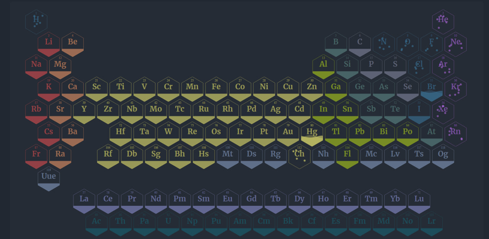

# Animated Periodic Table

A feature of this table is that each element is animated depending on the aggregate state of the substance: solid, liquid or gaseous.

## Implemented using the D3 js library.

D3.js is a JavaScript library for manipulating documents based on data. D3 helps you bring data to life using HTML, SVG, and CSS. D3’s emphasis on web standards gives you the full capabilities of modern browsers without tying yourself to a proprietary framework, combining powerful visualization components and a data-driven approach to DOM manipulation.

